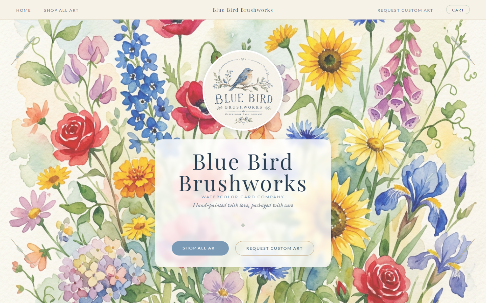

# Blue Bird Brushworks

E-commerce site for a hand-painted watercolor card company, built for a real client and live at
**[bluebirdbrushworks.com](https://bluebirdbrushworks.com)**.

## What it does

- **Storefront:** product catalog, photo gallery, and a cart persisted in `localStorage` so it
  survives the Stripe redirect.
- **Checkout:** Stripe Checkout with flat-rate shipping, free shipping over $50, and promo codes.
  Prices are looked up server-side from the database, so customers can't change amounts in the browser.
- **Order handling:** a signature-verified Stripe webhook records orders and line items.
- **Admin panel** (`/admin`), so the owner can run the shop without touching code:
  - add and edit products and mark them sold out, with photo upload, in-browser cropping and resizing
  - edit every piece of site text and imagery
  - manage promo codes
  - a stats dashboard with revenue, top sellers and recent orders
- **Custom art requests** through a Formspree form.
- **SEO and legal:** meta tags, structured data, `sitemap.xml`, `robots.txt`, and privacy, terms,
  shipping and returns pages.

## Stack

| Layer | Tech |
|---|---|
| Hosting | Cloudflare Pages (static HTML/CSS/JS) |
| API | Cloudflare Pages Functions (`functions/`) |
| Database | Cloudflare D1 (SQLite): products, content, orders, admin sessions |
| Images | Cloudflare R2, served through `functions/images/[key].js` |
| Payments | Stripe Checkout + webhooks |

## Security

- Admin login compares passwords in constant time and issues a random session token in an
  `HttpOnly; Secure; SameSite=Lax` cookie. Sessions are stored in D1 and checked by
  `functions/admin/_middleware.js`.
- Webhook events are verified against the Stripe signing secret before anything is written.
- Secrets live in Cloudflare environment variables, never in the repo.

## Configuration

Bindings and secrets set in the Cloudflare Pages project:

| Name | Purpose |
|---|---|
| `DB` | D1 database binding |
| `IMAGES` | R2 bucket binding |
| `STRIPE_SECRET_KEY` | Stripe API key |
| `STRIPE_WEBHOOK_SECRET` | Stripe webhook signing secret |
| `ADMIN_PASSWORD` | Admin panel password |
| `FORMSPREE_ORDER_FORM_ID` | Custom-request form |

The database schema is in `schema.sql`, with later changes in `migrations/`. `seed.sql` and
`seed-content.sql` load the starting products and site content.

## My role

I was the sole developer on this project. I gathered requirements with the owner, then designed,
built and deployed the site, and I maintain it.
